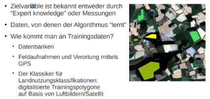
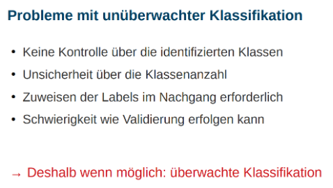
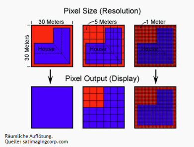

# Machine learning for remote sensing image classification

## Einführung

### Was versteht man unter Image Classification?
- Extraktion von Informationen aus einem Multiband-Raster
- Jede Rasterzelle besitzt einen Wert
- Schema kann aufgestellt werden
    - unterteilt Wertebereich des Rasters in Klassen
- Jeder Rasterzelle wird eine Klasse zugeordnet

### Was versteht man unter Machine Learning?
- Oberbegriff für “künstliche” Generierung von Wissen aus Erfahrung
- Algorithmen bauen statistisches Modell aus Trainingsdaten
- Beispiele werden nicht auswendig gelernt, sondern Muster werden erkannt
- symbolische Ansätze (explizite Repräsentation von Wissen)
- nicht-symbolische Ansätze (neuronale Netzwerke)

### Warum verwendet man Machine Learning?
- **Klassifizierungen** folgen bestimmten **Regeln**
    - Aus Regeln ergibt sich ein **Muster**
- Muster kann erkannt werden
- Klassifizierung kann von ML Algorithmus durchgeführt werden
- Höhere Effizienz als Entwicklung automatisierter „statischer“ Algorithmen
- Weniger Arbeitsintensiv

## Prinzip der Bildklassifizierung

- Computer beibringen, Muster und Merkmale in Fernerkundungsbilder erkennen
- Pixel und Vektoren werden kategorisiert und einer Klasse zugeordnet
- Erlaubt Quantifizierung von Flächenanteilen und Erstellung thematischer Karten

- Der Workflow besteht aus mehreren Schritten
- **Datenvorbereitung:** Menge von Bildern, die man analysieren möchte
- Unterscheidung Unüberwacht/Überwacht und Pixelbasiert/Objektbasiert
- **Segmentierung:** Farb- und Formeigenschaften werden berücksichtigt, wenn Pixel in Objekten gruppiert werden.
- **Labeling:** Kategorien erstellen und markieren. Wichtig beim markieren: Sichergehen, dass richtige Kategorie - zugeordnet wird bzw. wir wissen mitbringen darüber

    

- **Algorithmus-Training:** Algorithmus mit den Trainingsdaten füttern und Muster/Merkmale erkennen lassen
- **Klassifizierung neuer Daten:** Anschließend auch auf neue Bilder anwendbar

## Meist genutzten Methoden

### Es gibt drei Haupttypen von Methoden der Bildklassifizierung:

- ### Überwachte Klassifikation
    - Zusammenhänge zwischen Eingabedaten und Ausgabedaten anhand von Trainingsdaten
    - Der Computer/Algorithmus ist in der Lage Zusammenhänge, Rückschlüsse und Vorhersagen von den Trainingsdaten  abzuleiten
    - Trainingsdaten müssen bekannt sein
    - Bsp. für Algorithmen: **Maximum-Likeihood, Random Forest, Support Vector Machine**

- ### Unüberwachte Klassifikation
    

    - Nutzt keine Lernvorgaben -> Algorithmen können nicht trainiert werden
    - Verfahren des Data Mining werden genutzt
    - Ähnlichkeitskriterien aus Daten extrahieren und mit thematischer Bedeutung verknüpfen
    - Bsp.: Alle Clusterverfahren (z.B. K-means)

- ### Objektbasierte Klassifikation
    - Segmentierung: zerlegen des Bildes in Objekte, die landbasierte Merkmale darstellen
    - Klassifizierung: Klassifizierung dieser Objekte anhand ihrer Form, Größe, räumlichen und spektralen Eigenschaften
- Welche Methode benutzt wird, hängt u.a. von der räumlichen Auflösung des Bildes ab

    

- Bei hoher Auflösung können alle Methoden verwendet werden
    - Ein Pixel repräsentiert eine relativ kleine Fläche
    - Enthält genügend Informationen
    - Selten eine Überlappung von Informationen innerhalb eines Pixels
- Bei einer geringen Auflösung eher Objektbasierte Klassifikation
- Wahl hängt zwischen Genauigkeit und Rechenaufwand ab
- Objektbasierte Klassifikation ist genauer, erfordert jedoch oft viel mehr Rechenressourcen

## Literaturverzeichnis

https://gfzpublic.gfz-potsdam.de/rest/items/item_3539922_3/component/file_3539919/content

https://www.geoinformatics.uni-bayreuth.de/de/research/remote_sensing_image_analysis/index.html

https://learn.arcgis.com/de/paths/try-machine-learning-with-arcgis/

https://pro.arcgis.com/de/pro-app/latest/help/analysis/deep-learning/what-is-deep-learning-.htm 

https://de.wikipedia.org/wiki/Maschinelles_Lernen

https://pro.arcgis.com/de/pro-app/latest/help/analysis/image-analyst/overview-of-image-classification.htm 
