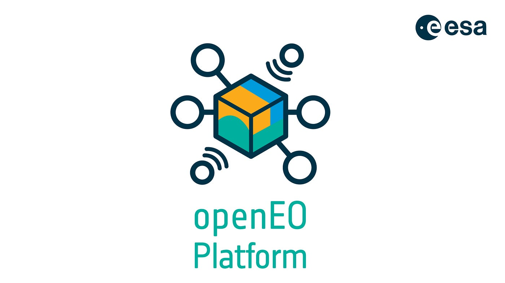

# OpenEO - Open Earth Observation 

authors: @wittrockscode, @martinkrg26
## Was ist OpenEO?  

**OpenIO** ist eine Initiative zur Vereinfachung des Zugangs und der Verarbeitung von Erdbeobachtungsdaten

### Es gibt zwei grundlegende Probleme:

* Downloadgröße von Erdbeobachtungsdaten ist viel zu groß!
* Organisation von Daten in „Tiles“ macht es unnötig kompliziert für die Analyse!

### Lösung:

1. Speichern von Daten in der Cloud
1. Im Backend berechnen und verarbeiten
1. die Ergebnisse abrufen oder entstandene Analysen downloaden.

## Wie macht OpenEO das?

OpenEO entwickelt eine ***API***, mit der Clients (R, Python, JavaScript) Erdbeobachtungsdaten im Backend auf eine simple und einheitliche Art und Weise verbinden können.

### Funktionalität ohne API

### Mit API von OpenEO

### API
* zum Erforschen (API, EO Data, Prozesse)
* Authentifizierung (OpenID Connect)
* Nutzt Prozesse (Funktionen)
	* [vordefinierte Prozesse](https://openeo.org/documentation/1.0/processes.html)
	* vom Nutzer selbst definierte Prozesse
	* vom Nutzer selbst definierte Funktionen in R, Python oder JavaScript
* Dateimanagement
* Web Services

## Merkmale von OpenEO

* Cloudbasiert
* Open Source
* Wird von der Community geleitet
* Vereinfachte Nutzung über Data Cubes

## Zum Verständnis, OpenEO ist kein(e)...

* anderer Cloud Provider
* geoprocessing software
* traditionelles GIS

## Clients
* [JavaScript](https://openeo.org/documentation/1.0/javascript/#installation) / TypeScript 
* [Python](https://openeo.org/documentation/1.0/python/) 
* [R](https://openeo.org/documentation/1.0/r/) 
*  [QGIS](https://openeo.org/documentation/1.0/qgis/)
* Browser (Web-Editor without programming) 

## Back-ends
* GeoPySpark (Geotrellis)
* **Google Earth Engine**
* GRASS GIS
* JEODPP
* OpenDataCube
* Apache Airflow / eoDataReaders
* **Sentinel Hub**
* WCPS (rasdaman)
* R back-end
* **OpenEO Platform**

## Andere Komponenten

### Was ist [OpenEO Platform](https://openeo.cloud/)
	
OpenEO Platform ist eine Implementierung der OpenEO-Spezifikationen. Diese Platform setzt die Prinzipien von OpenEO in die Praxis um und ist sozusagen das am naheligenste Back-end für EO-Daten

* Cloud Provider
* gefördert von der ESA
* Verfügbarkeit von Erdbeobachtungsdaten
* technische Umsetzung der OpenEO-Richtlinien

### OpenEO Hub

* OpenEO Community

### Implementierung und Nutzen am Beispiel von R

... 

## Ressourcen und Quellen

* https://openeo.org/about.html
* https://www.youtube.com/watch?v=tCoAedg6RWI
* [OpenEO Cookbook](https://openeo.org/documentation/1.0/cookbook/#chapter-1)
